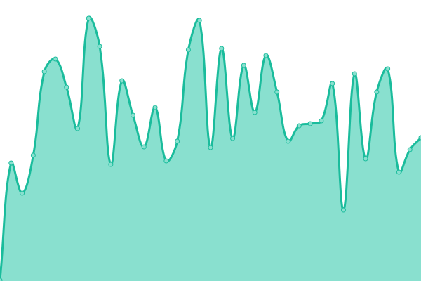

# [📈 Live Status](https://Midnigh7.github.io/StatusBoard): <!--live status--> **🟧 Partial outage**

This repository contains the open-source uptime monitor and status page for [Midnigh7](https://Midnigh7.github.io/StatusBoard), powered by [Upptime](https://github.com/upptime/upptime).

With [Upptime](https://upptime.js.org), you can get your own unlimited and free uptime monitor and status page, powered entirely by a GitHub repository. We use [Issues](https://github.com/Midnigh7/StatusBoard/issues) as incident reports, [Actions](https://github.com/Midnigh7/StatusBoard/actions) as uptime monitors, and [Pages](https://Midnigh7.github.io/StatusBoard) for the status page.

<!--start: status pages-->
<!-- This summary is generated by Upptime (https://github.com/upptime/upptime) -->
<!-- Do not edit this manually, your changes will be overwritten -->
<!-- prettier-ignore -->
| URL | Status | History | Response Time | Uptime |
| --- | ------ | ------- | ------------- | ------ |
|  [Auvik](https://mytech.us1.my.auvik.com/) | 🟩 Up | [auvik.yml](https://github.com/Midnigh7/StatusBoard/commits/HEAD/history/auvik.yml) | 

 811ms
     
 | 

<a href="https://Midnigh7.github.io/StatusBoard/history/auvik">100.00%</a>
    

|  [Cog](https://cog.mytechpartners.net/healthcheck) | 🟥 Down | [cog.yml](https://github.com/Midnigh7/StatusBoard/commits/HEAD/history/cog.yml) | 

 0ms
     
 | 

<a href="https://Midnigh7.github.io/StatusBoard/history/cog">0.00%</a>
    

|  [R2CW](https://cog.mytechpartners.net:8081/api?action=healthCheck) | 🟥 Down | [r2-cw.yml](https://github.com/Midnigh7/StatusBoard/commits/HEAD/history/r2-cw.yml) | 

 0ms
     
 | 

<a href="https://Midnigh7.github.io/StatusBoard/history/r2-cw">0.00%</a>
    

|  [Alloy](https://cog.mytechpartners.net:9090/healthCheck) | 🟩 Up | [alloy.yml](https://github.com/Midnigh7/StatusBoard/commits/HEAD/history/alloy.yml) | 

 171ms
     
 | 

<a href="https://Midnigh7.github.io/StatusBoard/history/alloy">100.00%</a>
    

|  [Flux](https://cog.mytechpartners.net:7070/healthCheck) | 🟩 Up | [flux.yml](https://github.com/Midnigh7/StatusBoard/commits/HEAD/history/flux.yml) | 

 173ms
     
 | 

<a href="https://Midnigh7.github.io/StatusBoard/history/flux">100.00%</a>
    

|  [ScreenConnect](https://go.mytech.com) | 🟩 Up | [screen-connect.yml](https://github.com/Midnigh7/StatusBoard/commits/HEAD/history/screen-connect.yml) | 

 491ms
     
 | 

<a href="https://Midnigh7.github.io/StatusBoard/history/screen-connect">100.00%</a>
    

|  [ScreenConnect Relay](screlay.mytech.com) | 🟩 Up | [screen-connect-relay.yml](https://github.com/Midnigh7/StatusBoard/commits/HEAD/history/screen-connect-relay.yml) | 

 83ms
     
 | 

<a href="https://Midnigh7.github.io/StatusBoard/history/screen-connect-relay">100.00%</a>
    

|  [N-Able](https://Manage.mytech.com) | 🟩 Up | [n-able.yml](https://github.com/Midnigh7/StatusBoard/commits/HEAD/history/n-able.yml) | 

 243ms
     
 | 

<a href="https://Midnigh7.github.io/StatusBoard/history/n-able">100.00%</a>
    

|  [ConnectWise Manage](https://connect.mytech.com) | 🟩 Up | [connect-wise-manage.yml](https://github.com/Midnigh7/StatusBoard/commits/HEAD/history/connect-wise-manage.yml) | 

 333ms
     
 | 

<a href="https://Midnigh7.github.io/StatusBoard/history/connect-wise-manage">100.00%</a>
    

|  [Immy.Bot](https://mytech.immy.bot) | 🟩 Up | [immy-bot.yml](https://github.com/Midnigh7/StatusBoard/commits/HEAD/history/immy-bot.yml) | 

 489ms
     
 | 

<a href="https://Midnigh7.github.io/StatusBoard/history/immy-bot">99.84%</a>
    

|  [ITGlue](https://mytech.itglue.com) | 🟩 Up | [it-glue.yml](https://github.com/Midnigh7/StatusBoard/commits/HEAD/history/it-glue.yml) | 

 578ms
     
 | 

<a href="https://Midnigh7.github.io/StatusBoard/history/it-glue">100.00%</a>
    

|  [LionGuard](https://mytech.app.liongard.com) | 🟥 Down | [lion-guard.yml](https://github.com/Midnigh7/StatusBoard/commits/HEAD/history/lion-guard.yml) | 

 0ms
     
 | 

<a href="https://Midnigh7.github.io/StatusBoard/history/lion-guard">0.00%</a>
    

|  [CloudFlare](https://www.cloudflarestatus.com/api/v2/status.json) | 🟩 Up | [cloud-flare.yml](https://github.com/Midnigh7/StatusBoard/commits/HEAD/history/cloud-flare.yml) | 

 260ms
     
 | 

<a href="https://Midnigh7.github.io/StatusBoard/history/cloud-flare">100.00%</a>
    

<!--end: status pages-->

[**Visit our status website →**](https://Midnigh7.github.io/StatusBoard)

## 📄 License

- Powered by: [Upptime](https://github.com/upptime/upptime)
- Code: [MIT](./LICENSE) © [Midnigh7](https://Midnigh7.github.io/StatusBoard)
- Data in the `./history` directory: [Open Database License](https://opendatacommons.org/licenses/odbl/1-0/)
